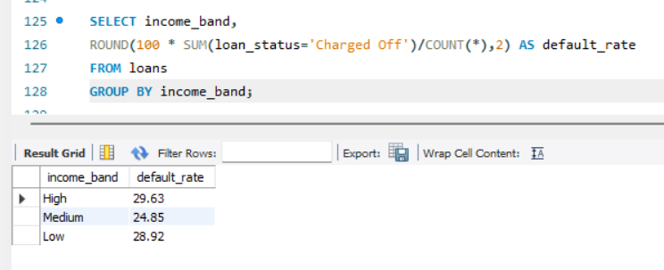
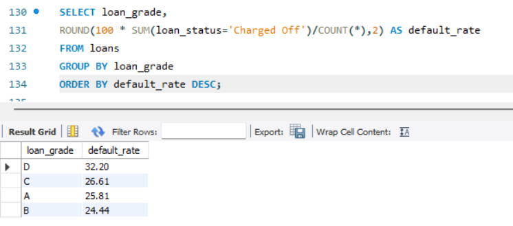
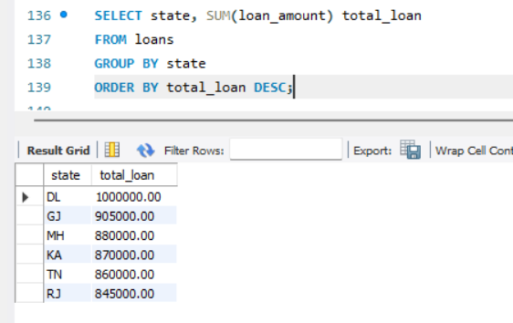
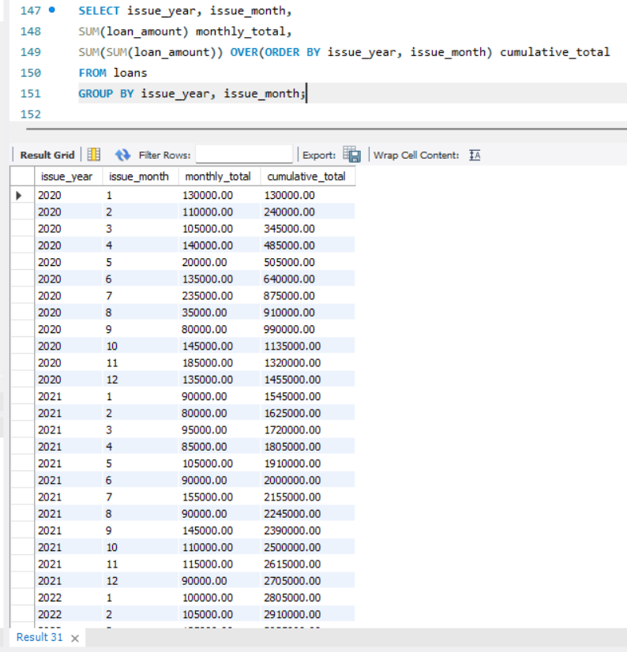
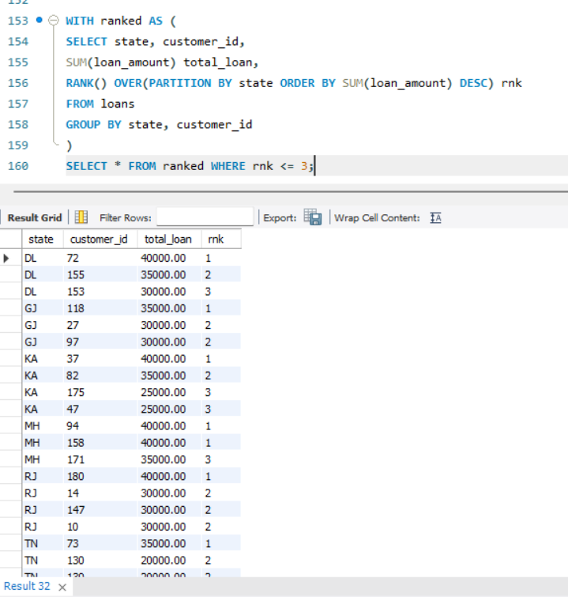

# Bank Loan Risk & Performance Analysis (Advanced SQL Project)

##  Project Objective
To analyze loan portfolio performance, default risk patterns, customer concentration, and revenue generation using advanced SQL techniques and business-driven analytics.

This project simulates real-world financial portfolio evaluation using structured data cleaning, feature engineering, and advanced querying techniques.

---

##  Data Architecture

Raw Layer → Staging Layer → Production Analytics Table

- **Raw Layer:** Imported original dataset (505 rows) without modification.
- **Staging Layer:** Removed duplicate records and validated data quality (500 rows).
- **Production Layer:** Cleaned and transformed dataset used for final business analysis (410 rows).

The layered approach ensures data traceability, auditability, and separation of cleaning logic from analytical computations.

---

##  Data Cleaning Process

- Identified and removed 5 duplicate loan records.
- Filtered rows with invalid or null `loan_amount` (critical financial metric).
- Converted VARCHAR numeric fields into appropriate DECIMAL data types.
- Removed '%' symbol from `interest_rate` and standardized values.
- Converted `issue_date` into proper DATE format.
- Engineered derived analytical columns:
  - `income_band`
  - `dti_band`
  - `risk_flag`
  - `issue_year`, `issue_month`
  - `estimated_interest`

Dataset reduction from **505 → 410 rows** ensured analytical reliability by eliminating incomplete financial records that could distort exposure and default rate calculations.

---

##  SQL Concepts Demonstrated

- Aggregations (SUM, COUNT, AVG)
- Conditional logic using CASE
- Common Table Expressions (CTE)
- Window Functions (RANK, SUM OVER)
- Cumulative calculations
- Portfolio share percentage analysis
- Index creation for performance optimization
- Data validation & integrity checks

---

##  Key Analytical Insights

1. **High income segment shows highest default rate (~29.6%)**, indicating potential over-leveraging or larger ticket loan exposure within this segment.
2. **Grade C loans carry the highest default exposure**, suggesting mid-tier credit risk concentration.
3. **Delhi (DL) contributes the highest total loan exposure (~10,00,000+)**, creating geographic concentration risk.
4. Loan issuance trend indicates steady portfolio expansion, increasing overall exposure and potential risk if underwriting standards are not proportionally strengthened.
5. High DTI borrowers show strong correlation with elevated `risk_flag`, reinforcing DTI as a key underwriting variable.
6. Top 3 customers per state contribute disproportionately to total interest revenue, indicating portfolio concentration dependency.

---

##  Business Recommendations

1. Re-evaluate lending criteria for high-income borrowers with large loan amounts.
2. Tighten underwriting controls for Grade C category.
3. Diversify state-level portfolio exposure to reduce geographic concentration risk.
4. Implement DTI-based pre-approval scoring mechanisms.
5. Monitor top borrowers for concentration risk and early credit stress signals.

---

##  How to Run This Project

1. Execute `schema.sql`
2. Import `raw_dataset.csv` into the staging table
3. Run `cleaning_queries.sql`
4. Run `analysis_queries.sql`
5. Run `advanced_queries.sql`

---

##  Project Structure

Bank-Loan-SQL-Project/
│
├── raw_dataset.csv
├── schema.sql
├── cleaning_queries.sql
├── analysis_queries.sql
├── advanced_queries.sql
├── README.md
└── screenshots/

---

##  Sample Query Outputs

### Default Rate by Income Band

### Grade-wise Default Rate

### State-wise Loan Exposure

### Cumulative Loan Trend

### Top  Customers per State

##  Conclusion

This project demonstrates production-ready SQL capability including structured data cleaning, feature engineering, advanced analytical querying, and business-oriented interpretation of financial risk.

The analysis reflects practical readiness for data analyst roles involving financial risk assessment, portfolio analytics, and decision-support reporting.